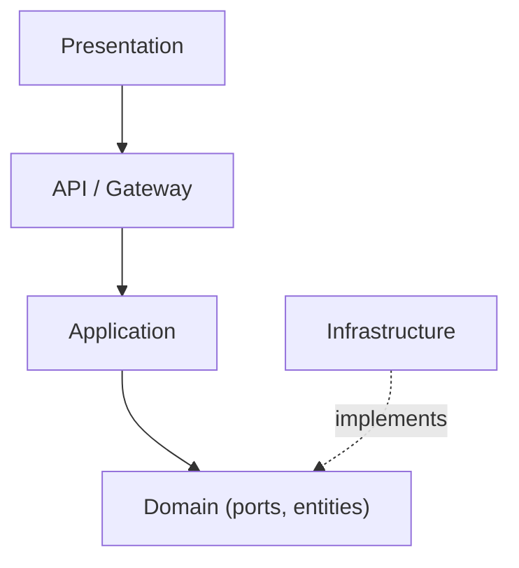

# Phase 1 — Repository Retrieval & Graph Handling

**Read this whole file before writing any code.** It tells you what the full project is, then scopes exactly what you are building right now. The full-project section is context only — do not implement anything from it. Every ambiguity that could cause you to guess has been resolved below to one specific, concrete decision — do not substitute your own default.

---

## Full Project Context (context only — do not build this yet)

This is a multi-agent AI code review platform, exposed as a chat assistant. A user connects a GitHub repository; the system maintains a live code graph of it (via CRG); when a diff or question comes in, an orchestrator routes it to specialized subagents (Compliance, Security, Performance, Regression, Fix Suggestion), each grounding its findings in graph queries and other MCP tools; an aggregator merges their outputs into one chat reply. Frontend is React, backend is FastAPI, conversation memory is stored inside a database (the type will be given to you  later in next phases)  with LangMem-based summarization.

**None of that is in scope for this phase.** No subagents, no orchestrator, no aggregator, no LLM calls, no frontend, no conversation database. This phase builds the foundation those later phases will depend on: getting a user's code onto disk, and keeping a CRG graph of it continuously up to date.

---

## The 5-Layer Architecture (applies to the whole project — follow it now too)

| Layer | Contains | Depends on |
|---|---|---|
| 1. Presentation | React chat UI | Layer 2 only |
| 2. API / Gateway | FastAPI routes, request/response models | Layer 3 |
| 3. Application | Use-case services | Layer 4 |
| 4. Domain | Contracts, entities, ports — pure Python, no framework/library imports | nothing |
| 5. Infrastructure | Concrete implementations (git, CRG, DB, MCP) | Implements Layer 4's interfaces |

**Hard rule:** a file under `domain/` must never import FastAPI, `git`/`subprocess`, an MCP client, or `sqlmodel`. If it needs to, it belongs in `infrastructure/`. Application only ever depends on Domain's interfaces (ports), never directly on an Infrastructure class.



---

## Phase 0 — Getting the User's Code Onto Disk (prerequisite for Phase 1)

CRG cannot fetch code itself. It only reads files already sitting at a local path (`repo_root`). Something has to put them there first — that's Phase 0.

### Facts to build against (confirmed, not assumed)

- CRG has **no GitHub/git-clone capability of its own**. Every CRG tool takes `repo_root` — a path that must already exist on disk with the code checked out.
- CRG's incremental update auto-detects changed files by running `git diff` **locally** at `repo_root`, between a `base` commit SHA and current HEAD. It does **not** need or want the webhook payload's changed-file list.
- Downloading a GitHub tarball/zip (no `.git` history) is not viable — no history means no `git diff`, means every update becomes a full rebuild, defeating the reason CRG was chosen.

### What to build

1. **First-time clone:** when a user connects a repo, `git clone` (shallow) it into a persistent workspace directory.
2. **Subsequent updates:** on each GitHub push webhook, `git fetch` + checkout the *existing* workspace to the new commit. Do not re-clone.
3. **Storage — web-app specific, don't assume a CLI tool's defaults apply:**
   - Workspaces must live on a **persistent volume**, not ephemeral container storage.
   - **Never put workspace/CRG directories on network-shared storage (NFS, etc.).** CRG's graph store is SQLite, and SQLite is unsafe on network filesystems. Local disk on a single instance only, for now.
   - Sanitize any repo identifier before using it in a filesystem path — it originates from a request, treat it as untrusted input.
   - Add an eviction policy (e.g. LRU by last-reviewed date) so workspace storage doesn't grow unbounded.

---

## Phase 1 — Graph Handling with CRG

### What CRG is

`code-review-graph` (CRG) — a Tree-sitter-based tool that builds a structural knowledge graph of a codebase, stored locally in SQLite, queried via its own MCP server. Repo: `github.com/tirth8205/code-review-graph`.

### All of CRG's MCP tools (for your awareness — see scope note below)

| Category | Tools |
|---|---|
| Build/health | `build_or_update_graph_tool`, `list_graph_stats_tool`, `get_minimal_context_tool` |
| Blast radius / risk | `get_impact_radius_tool`, `detect_changes_tool`, `get_affected_flows_tool` |
| Graph queries | `query_graph_tool`, `traverse_graph_tool`, `semantic_search_nodes_tool` |
| Execution flows | `list_flows_tool`, `get_flow_tool` |
| Structure | `list_communities_tool`, `get_community_tool`, `get_architecture_overview_tool` |
| Hotspots | `get_hub_nodes_tool`, `get_bridge_nodes_tool`, `get_surprising_connections_tool`, `get_knowledge_gaps_tool` |
| Code quality | `find_large_functions_tool`, `refactor_tool`, `apply_refactor_tool` |
| Docs/wiki | `get_docs_section_tool`, `generate_wiki_tool`, `get_wiki_page_tool`, `get_suggested_questions_tool` |
| Multi-repo | `list_repos_tool`, `cross_repo_search_tool` |
| Embeddings | `embed_graph_tool` |

**Scope for this phase: implement and call `build_or_update_graph_tool` only.** Every other tool is for subagents built in a later phase. Do not write code that calls them now.

### `build_or_update_graph_tool` — exact parameters (confirmed from the live server schema)

| Parameter | Type | Default | Notes |
|---|---|---|---|
| `repo_root` | string \| null | `null` | Path to the local workspace. **Always pass this explicitly** — never rely on auto-detection, since one shared server handles many repos |
| `full_rebuild` | boolean | `false` | `false` = incremental update. Use `true` only for the first build of a repo |
| `base` | string | `"HEAD~1"` | Commit to diff against. Pass the previously-indexed commit SHA, not the default |

### Launching the server

```bash
code-review-graph serve --http --port 5555
```

One shared server for the whole backend, not one process per repo. Every tool call passes its own `repo_root`.

---

## Resolved Implementation Decisions

These remove the specific ambiguities that would otherwise cause hallucination. Do not substitute a different library, pattern, or default than what's specified here.

### 1. Metadata storage: SQLite + SQLModel

No external database server for this phase — the simplest pairing with FastAPI, zero infrastructure to run. File lives at `data/phase1_metadata.db`. Two tables, defined exactly as follows — do not invent additional columns or a different ORM:

```python
# infrastructure/db/models.py
from datetime import datetime
from sqlmodel import SQLModel, Field

class RepoWorkspace(SQLModel, table=True):
    id: int | None = Field(default=None, primary_key=True)
    repo_id: str = Field(unique=True, index=True)   # e.g. "owner/repo"
    local_path: str
    last_synced_commit: str | None = None
    created_at: datetime = Field(default_factory=datetime.utcnow)
    updated_at: datetime = Field(default_factory=datetime.utcnow)

class GraphSnapshot(SQLModel, table=True):
    id: int | None = Field(default=None, primary_key=True)
    repo_id: str = Field(index=True)
    commit_hash: str
    status: str                        # "building" | "ready" | "error"
    error_message: str | None = None
    started_at: datetime = Field(default_factory=datetime.utcnow)
    completed_at: datetime | None = None
```

Engine: `create_engine("sqlite:///data/phase1_metadata.db")`. This is infrastructure-layer code — `domain/entities/` holds the plain-Python equivalents (`RepoWorkspace`, `GraphBuildStatus` dataclasses with no SQLModel/DB import) that these tables persist.

### 2. MCP client: official `mcp` Python SDK, Streamable HTTP

Confirmed from the SDK's own docs (`py.sdk.modelcontextprotocol.io/client/`) — use exactly this pattern, not `httpx` directly and not a hand-rolled JSON-RPC client:

```python
# infrastructure/graph_builder/crg_mcp_adapter.py
from mcp import ClientSession
from mcp.client.streamable_http import streamable_http_client

async def call_crg_tool(server_url: str, tool_name: str, arguments: dict) -> dict:
    async with streamable_http_client(server_url) as (read, write, _):
        async with ClientSession(read, write) as session:
            await session.initialize()
            result = await session.call_tool(tool_name, arguments=arguments)
            if result.is_error:
                # This is CRG reporting a real failure (e.g. bad repo_root) — do not retry, surface it.
                raise CRGToolError(result.content)
            return result.structured_content
```

**Retry policy:** retry only on transport-level failures (connection refused, timeout) — not on `result.is_error`, which means CRG responded and rejected the call. 3 attempts, exponential backoff (1s, 2s, 4s). After 3 failures, return `GraphBuildStatus(status="error", error_message=...)` — do not raise an unhandled exception out of `GraphBuilderPort`.

### 3. GitHub webhook payload parsing

- New commit SHA: **`payload["after"]`** (top-level field — not `payload["commit_sha"]`, not nested).
- Skip processing if `after == "0000000000000000000000000000000000000000"` — this is GitHub's convention for a branch deletion push; there's no new commit to index.
- Repo identifier: `payload["repository"]["full_name"]`.
- Signature verification — required, do not skip:

```python
import hmac, hashlib

def verify_signature(raw_body: bytes, signature_header: str, secret: str) -> bool:
    expected = "sha256=" + hmac.new(secret.encode(), raw_body, hashlib.sha256).hexdigest()
    return hmac.compare_digest(expected, signature_header)
```

Verify against the **raw request body bytes**, before JSON-parsing it. Header name: `X-Hub-Signature-256`.

### 4. Concurrency lock: file-based, not `asyncio.Lock`, not Redis

`asyncio.Lock` only coordinates within one process — it does nothing if uvicorn runs multiple workers, which is a standard production setup. Redis is unnecessary infrastructure for a single-instance, local-disk phase. Use a **file lock**, one per repo workspace, via the `filelock` library — this works across multiple worker processes on the same machine, consistent with the local-disk-only decision already made in Phase 0:

```python
from filelock import FileLock

lock_path = f"{workspace_root}/{repo_id_safe}/.sync.lock"
with FileLock(lock_path, timeout=5):
    # git fetch/checkout + build_or_update_graph_tool call happens here
```

### 5. Configuration: `pydantic-settings`

```python
# infrastructure/config.py
from pydantic_settings import BaseSettings

class Settings(BaseSettings):
    github_webhook_secret: str
    crg_server_url: str = "http://localhost:5555/mcp"
    workspace_root: str = "./data/workspaces"
    metadata_db_path: str = "./data/phase1_metadata.db"

    class Config:
        env_file = ".env"

settings = Settings()
```

### 6. Git operations: `subprocess`, not GitPython

Plain `subprocess.run(["git", ...])` — no extra dependency, behavior is exactly the documented git CLI, easy to reason about and test:

```python
# infrastructure/repo_source/git_repo_source.py
import subprocess

def run_git(args: list[str], cwd: str) -> str:
    result = subprocess.run(["git", *args], cwd=cwd, capture_output=True, text=True, check=True)
    return result.stdout.strip()

# clone:    run_git(["clone", "--depth", "1", repo_url, local_path], cwd=".")
# fetch:    run_git(["fetch", "origin", commit_sha], cwd=local_path)
# checkout: run_git(["checkout", commit_sha], cwd=local_path)
```

---

## Folder Architecture (Phase 0 + Phase 1 only)

```
backend/src/code_review_agent/
│
├── domain/
│   ├── entities/
│   │   ├── repo_workspace.py         # RepoWorkspace dataclass (no SQLModel import — that's infra's version)
│   │   └── graph_build_status.py     # GraphBuildStatus(commit_hash, status, started_at, completed_at, error_message)
│   ├── repo/
│   │   └── repo_source_port.py       # RepoSourcePort — clone(url) / sync(workspace, ref). No git import here.
│   └── graph/
│       └── graph_builder_port.py     # GraphBuilderPort — build(repo_root) / update(repo_root, base). No MCP import here.
│
├── application/
│   ├── repo_ingestion_service/
│   │   ├── clone_repository.py       # first connect: RepoSourcePort.clone() -> GraphBuilderPort.build(full_rebuild=True)
│   │   └── sync_on_webhook.py        # each push: acquire lock -> RepoSourcePort.sync() -> GraphBuilderPort.update(base=last_synced_commit)
│   └── graph_build_service/
│       └── graph_readiness_service.py # checks GraphSnapshot.status == "ready" for a given commit
│
├── infrastructure/
│   ├── config.py                     # Settings (pydantic-settings) — see Resolved Decisions #5
│   ├── repo_source/
│   │   └── git_repo_source.py        # implements RepoSourcePort via subprocess + git CLI — see #6
│   ├── graph_builder/
│   │   └── crg_mcp_adapter.py        # implements GraphBuilderPort via official mcp SDK — see #2
│   ├── graph_service/
│   │   └── crg_server_manager.py     # starts/health-checks `code-review-graph serve --http --port 5555`
│   ├── workspace/
│   │   ├── workspace_path_resolver.py    # sanitizes repo_id -> safe local path
│   │   ├── workspace_lock.py             # FileLock wrapper — see #4
│   │   └── workspace_eviction_service.py # evicts least-recently-reviewed workspaces
│   ├── api/routes/
│   │   └── webhooks.py               # verifies signature, parses payload — see #3
│   └── db/
│       ├── models.py                 # RepoWorkspace, GraphSnapshot SQLModel tables — see #1
│       └── engine.py                 # create_engine("sqlite:///data/phase1_metadata.db")
│
├── scripts/
│   └── run_crg_server.sh             # `code-review-graph serve --http --port 5555`
│
├── data/                             # gitignored — persistent volume mount point
│   ├── phase1_metadata.db
│   └── workspaces/
│
└── docker-compose.yaml               # workspace_root and data/ must be a named volume, not a bare container path
```

---

## Documentation Links

Use these — don't rely on training-data memory for any of this, it's recent enough to be wrong or incomplete.

| Tool | Repository | Docs |
|---|---|---|
| CRG (code-review-graph) | `github.com/tirth8205/code-review-graph` | `code-review-graph.com`, `docs/COMMANDS.md` in the repo |
| MCP Python SDK | `github.com/modelcontextprotocol/python-sdk` | `py.sdk.modelcontextprotocol.io` — specifically the `/client/` page for the exact Streamable HTTP pattern used above |
| SQLModel | `github.com/fastapi/sqlmodel` | `sqlmodel.tiangolo.com` |
| GitHub Webhooks | — | `docs.github.com/en/webhooks` |
| FastAPI | — | `fastapi.tiangolo.com` |
| Git | — | `git-scm.com/doc` |

---

## Definition of Done for This Phase

- [ ] A user-connected repo gets shallow-cloned into a persistent, sanitized workspace path.
- [ ] A GitHub push webhook (signature verified via `X-Hub-Signature-256`, checked against the raw body) triggers `git fetch` + checkout on the existing workspace — no re-cloning.
- [ ] The all-zeros `after` SHA (branch deletion) is detected and skipped.
- [ ] `build_or_update_graph_tool` is called correctly via the official `mcp` SDK's `streamable_http_client`: `full_rebuild=true` on first build, `full_rebuild=false` + correct `base` on every incremental update.
- [ ] A `GraphSnapshot` row exists per build/update with `commit_hash` and `status`, stored in the SQLite metadata DB via SQLModel.
- [ ] A `FileLock` prevents two webhooks for the same repo from racing each other — verified this also works across multiple uvicorn workers, not just within one process.
- [ ] Transport failures to the CRG server retry (3x, exponential backoff); `result.is_error` responses do not retry and are surfaced as `status="error"`.
- [ ] Workspace storage does not grow unbounded (eviction policy exists, even if simple).
- [ ] Domain layer has zero imports of `git`/`subprocess`, `mcp`, `sqlmodel`, or FastAPI.
- [ ] Nothing from "Full Project Context" above has been built — no subagents, no orchestrator, no frontend, no conversation DB, no CRG tool other than `build_or_update_graph_tool`.
